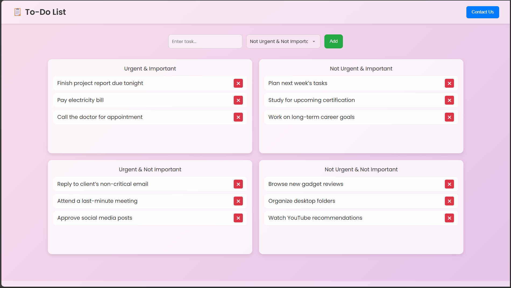

# 📋 Priority To-Do App

A modern, responsive to-do list application that uses the Eisenhower Matrix to prioritize tasks based on importance and urgency. Features a dynamic background, transparent glassmorphism design, and persistent task storage using `localStorage`.

---

## 🚀 Features

- 🧠 Categorize tasks by:
  - Urgent & Important
  - Not Urgent & Important
  - Urgent & Not Important
  - Not Urgent & Not Important
- ✨ Transparent, minimal UI with dynamic gradient background
- 📝 Add & delete tasks
- 💾 Tasks persist on page reload via `localStorage`
- 📱 Fully responsive layout (mobile, tablet, desktop)
- 📬 Contact form section with validation

---

## 🖼️ Demo

 <!-- Replace with actual screenshot path -->

---

## 📂 Project Structure
```
priority-todo-app/
│
├── index.html # Main HTML file
├── styles.css # All styles (glassmorphism + layout)
├── script.js # Task logic, localStorage & validation
├── README.md # You're here!
└── screenshot.png # App preview image (optional)
```

---

## 💡 How It Works

- Tasks are entered via an input and assigned to one of four categories.
- Each category appears in a fixed-size scrollable box within a 2x2 grid layout.
- Tasks are saved in the browser’s `localStorage`, so they remain even after refreshing or closing the tab.
- The **Contact Us** form appears at the bottom of the page and includes basic form validation.

---

## 🔧 Tech Stack

- HTML5
- CSS3 (Glassmorphism + Responsive Grid)
- JavaScript (Vanilla)
- `localStorage` for persistence

---

## 📥 Getting Started

1. Clone the repository:
   ```bash
   git clone https://github.com/yourusername/priority-todo-app.git
   cd priority-todo-app
   ```
2. Open index.html in your browser — no backend required.

# 🛡️ License
This project is open source and available under the [MIT License](LICENCE.txt).

# 🙌 Author
Made with 💙 by Jenish Allen Immanuel J

---

Let me know if you'd like the screenshot, license, or GitHub Pages deployment section added too!
